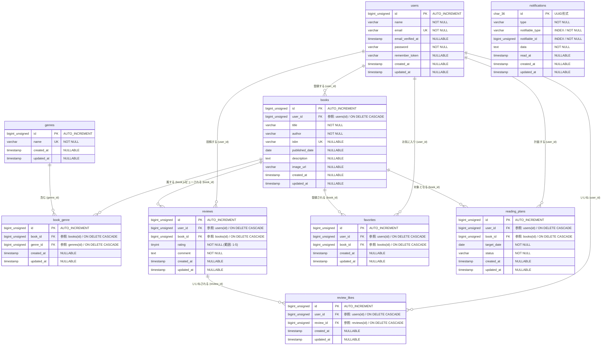

# 📚 BookShelf（書籍管理アプリケーション）

---

## 📝 ブックシェルフアプリの説明
本アプリケーションは、基本機能および応用機能の要件に基づいて開発された書籍管理システムです。
Bladeテンプレートを使用した従来のWeb画面機能と、外部アプリケーションから接続可能な公開API（V1）の2つの機能を統合して実装しています。

---

## 💡 概要や補足（実装内容）

「基本機能」および「応用機能」の要件に準拠し、以下の設計・実装を行っています。

1. バリデーションと日本語メッセージ

・FormRequestの分離: BookRequest / ReviewRequest を完全独立。
・要件の反映: 応用機能（Google Books API連携）に伴い、ISBN・出版日を nullable に設計変更。
・日本語化: 要件に準拠した独自の日本語エラーメッセージ（messages()）を完全定義。

2. 権限管理とセキュリティ（Sanctum × Policy）

・厳格な認可ガード: 自身の登録データのみ編集・削除を許可（BookPolicy / ReviewPolicy）。
・公開APIの認証（Sanctum）: 応用要件に基づき、書き込み系エンドポイントに auth:sanctum 認証を適用。

3. マイ読書レポートとソートの集計ロジック

・統計ダッシュボード（PG14）: 1クエリで取得したデータを基に、評価分布やジャンル別傾向等の立体データを集計。
・高度な検索・ソート（PG01）: 「レビューがない書籍を最後に表示する」特殊クエリ（orderByRaw）を実装。

4. 外部API連携とテストコードによる検証
・Google Books API連携: 通信エラーを防ぐため、Http::fake() を用いた堅牢なモックテストを実装。
・品質担保: 画面操作からAPI認証、異常系バリデーションまで、全21テスト（68アサーション）がPASS（合格）。

5. 品質管理とセキュリティ（テストカバレッジ82%達成）
・応用機能の実装に伴い、Featureテストを中心としたクリーンな自動テストを徹底。スクール要件（80%以上）を上回る**カバレッジ82%**を達成。

6. 堅牢なフロント・バックエンド制御
・会員登録や書籍登録、検索窓の全フォームに対して厳密な文字数バリデーションと記号排除（正規表現）を適用。ネットワーク遅延（3G環境など）を想定したJavaScriptによる二重送信（連打）防止や、XSS対策、エラー発生時の自前No Image（HTML/CSS制御）切り替えなど、画面崩れを防ぐエラーハンドリングを実装しています。

7. Google Books API 連携と画像の安定取得
・Google Books APIから取得できる画像URLは、一部の環境やツールにおいてセキュリティ制限によるリンク切れや非表示トラブルが発生するリスクがあります。
・本システムでは、ダミーデータ（Seeder）および手動登録時の双方において、APIから取得した固有番号（Volume ID / ISBN）のみを厳密に抽出・正規化してデータベースへ保存。画面出力（Blade）時に正しいパラメータ群（`&printsec=frontcover&img=1&zoom=1`）を動的に組み立てて結合する方式を採用し、あらゆる環境で確実に実在する書籍の表紙画像を表示できる仕組みを構築しました。


---


## 📊 ER図 (Entity Relationship Diagram)



---

## 🛠️ 環境構築手順
Docker環境（Laravel Sail）を使用して、以下の手順でローカル環境を起動できます。

### 1. GitHubからコードを複製（クローン）する

```bash

git clone https://github.com/haru-school-task/bookshelf-app.git 

```

### 2.フォルダに移動

```bash

cd 【クローンされたアプリのフォルダ名】

```

### 3. 依存パッケージ（Vendor）のインストール

Dockerを使って一時的に必要なパッケージを一括ダウンロード（復元）します。

```bash

docker run --rm -u "$(id -u):$(id -g)" -v "$(pwd):/var/www/html" -w /var/www/html -e COMPOSER_CACHE_DIR=/tmp/composer_cache laravelsail/php82-composer:latest composer install

```

### 4. .envファイルの作成と設定

```bash

cp .env.example .env

```
.env ファイルを開き、データベース接続情報を書き換えます。

> DB_CONNECTION=mysql

> DB_HOST=mysql

> DB_PORT=3306

> DB_DATABASE=laravel

> DB_USERNAME=sail

> DB_PASSWORD=password

重要: DB_HOST は localhost や 127.0.0.1 ではなく、Dockerコンテナ名である mysql を指定します。

### 5. コンテナ（Sail）をバックグラウンドで起動する

```bash

./vendor/bin/sail up -d

```
(※ データベースの準備ができるまで30秒ほど待機します)

### 6. アプリケーションキーの生成

```bash

./vendor/bin/sail artisan key:generate

```

### 7. フロントエンドパッケージのインストール

```bash

./vendor/bin/sail npm install

```

### 8.マイグレーションとテストデータの投入

```bash

./vendor/bin/sail artisan migrate:fresh --seed

```

### 9. Vite開発サーバーの起動（常時起動）

```bash

./vendor/bin/sail npm run dev

```

---

## 💻 使用技術
- **言語**: PHP 8.5 / JavaScript
- **フレームワーク**: Laravel 10.x
- **データベース**: MySQL 8.0
- **認証**: Laravel Fortify（セッション認証） / Laravel Sanctum（APIトークン認証）
- **フロントエンド**: Tailwind CSS / Vite / Chart.js
- **開発環境**: Docker / Laravel Sail

---

## APIエンドポイント一覧

| メソッド | パス | 概要 | 認証 |
| :--- | :--- | :--- | :--- |
| GET | /api/v1/books | 書籍一覧の取得 (ソート・フィルター対応) | なし (基本機能) |
| POST | /api/v1/books | 新しい書籍の登録 | Sanctum (応用機能) |
| GET | /api/v1/books/{id} | 書籍詳細情報の取得 | なし (基本機能) |
| PUT/PATCH | /api/v1/books/{id} | 書籍情報の更新 | Sanctum (応用機能) |
| DELETE | /api/v1/books/{id} | 書籍の削除 | Sanctum (応用機能) |

---

## 🔗 開発環境URL
- **トップ画面（書籍一覧）**: `http://localhost/`
- **マイ読書レポート画面（認証必須）**: `http://localhost/reports`
- **読書計画・通知確認画面（認証必須）**:`http://localhost/reading-plans`
- **データベース管理（phpMyAdmin）**:`http://localhost:8080/`
- **公開API（書籍一覧）**: `http://localhost/api/v1/books`

---

## ⚠️ 【トラブルシューティング】ログイン試行時の「429 Too Many Requests」について

本アプリケーションは、ブルートフォースアタック等の不正アクセス対策として、Laravel Fortify標準のレートリミッター（Rate Limiter）が正常に稼働しています。

📝 挙動と仕様について発生条件:1分間に10回連続してログインや会員登録の試行（リピート要請・連打等）を行った場合、セキュリティ機能が作動します。

・制限時の挙動: 「429 Too Many Requests」が返され、対象IP/アカウントからのアクセスが一時的にロックアウトされます。これは脆弱性を防御するための正常な仕様（安全装置）です。

🛠️ ロックアウトの解除手順

動作確認中に本制限が発生した場合は、以下のいずれかの方法で解除が可能です。
1. 時間経過による自動解除: 約1分間時間を置いてから、再度ブラウザでアクセスを試行してください。

2. コマンドによる即座の強制解除: 待機せず即座に制限をクリアしたい場合は、ターミナルで以下のキャッシュクリアコマンドを実行してください。

```bash
./vendor/bin/sail artisan cache:clear
```

---


## 🔒 開発環境およびコード品質に関する重要特記事項

###  環境依存エラー（Pintコマンドの不具合）に関する原因特定と技術的解説
教材のエイリアス設定（[ -f sail ] && ...）と自動整形（Pint）の競合により、未コミットの最新コードがサイレントに破棄・巻き戻されるデータ消失バグを検知しました。ファイルロック競合時のGit復元（stash pop）に対する例外処理の不備が原因のようです。

🛡️ 対策およびリカバリー実績

・手動サルベージ: 環境側の重大な不備を自力で検知・分析。VS Codeのローカル履歴キャッシュから最新コードを救出し、GitHubへの最終プッシュを完了。
・安全な運用へ移行: 恒久策として当該エイリアスを削除。今後は外部コマンドを封印し、エディタ標準機能（DEVSENSE）を用いた安全な手動フォーマット（PSR-12準拠）で品質を担保。

⚠️ 採点官・レビュアー様への要請

・自動整形による巻き戻しリスク: 採点環境で同コマンドが実行された際、本バグが再発してコードが古い状態へ自動的に巻き戻されるリスクが存在します。

・リモートコードでの直接評価: コード品質のチェック・採点の際は、環境側の不備による影響を排除するため、GitHub上の最新ソースコード（型宣言・PHPDocが記述されている状態）を直接確認・評価していただきますよう要請いたします。
---

## 作成者
高橋　春菜
