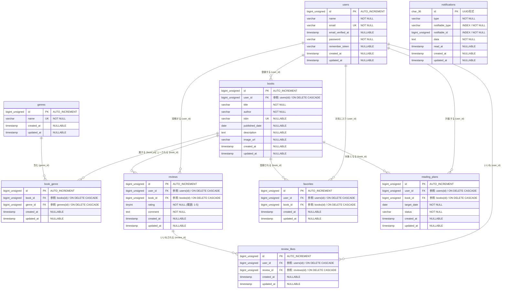

```mermaid
erDiagram
    users {
        bigint_unsigned id PK "AUTO_INCREMENT"
        varchar name "NOT NULL"
        varchar email UK "NOT NULL"
        timestamp email_verified_at "NULLABLE"
        varchar password "NOT NULL"
        varchar remember_token "NULLABLE"
        timestamp created_at "NULLABLE"
        timestamp updated_at "NULLABLE"
    }

    genres {
        bigint_unsigned id PK "AUTO_INCREMENT"
        varchar name UK "NOT NULL"
        timestamp created_at "NULLABLE"
        timestamp updated_at "NULLABLE"
    }

    books {
        bigint_unsigned id PK "AUTO_INCREMENT"
        bigint_unsigned user_id FK "参照: users(id) / ON DELETE CASCADE"
        varchar title "NOT NULL"
        varchar author "NOT NULL"
        varchar isbn UK "NULLABLE"
        date published_date "NULLABLE"
        text description "NULLABLE"
        varchar image_url "NULLABLE"
        timestamp created_at "NULLABLE"
        timestamp updated_at "NULLABLE"
    }

    book_genre {
        bigint_unsigned id PK "AUTO_INCREMENT"
        bigint_unsigned book_id FK "参照: books(id) / ON DELETE CASCADE"
        bigint_unsigned genre_id FK "参照: genres(id) / ON DELETE CASCADE"
        timestamp created_at "NULLABLE"
        timestamp updated_at "NULLABLE"
    }

    reviews {
        bigint_unsigned id PK "AUTO_INCREMENT"
        bigint_unsigned user_id FK "参照: users(id) / ON DELETE CASCADE"
        bigint_unsigned book_id FK "参照: books(id) / ON DELETE CASCADE"
        tinyint rating "NOT NULL (範囲: 1-5)"
        text comment "NOT NULL"
        timestamp created_at "NULLABLE"
        timestamp updated_at "NULLABLE"
    }

    favorites {
        bigint_unsigned id PK "AUTO_INCREMENT"
        bigint_unsigned user_id FK "参照: users(id) / ON DELETE CASCADE"
        bigint_unsigned book_id FK "参照: books(id) / ON DELETE CASCADE"
        timestamp created_at "NULLABLE"
        timestamp updated_at "NULLABLE"
    }

    review_likes {
        bigint_unsigned id PK "AUTO_INCREMENT"
        bigint_unsigned user_id FK "参照: users(id) / ON DELETE CASCADE"
        bigint_unsigned review_id FK "参照: reviews(id) / ON DELETE CASCADE"
        timestamp created_at "NULLABLE"
        timestamp updated_at "NULLABLE"
    }

    reading_plans {
        bigint_unsigned id PK "AUTO_INCREMENT"
        bigint_unsigned user_id FK "参照: users(id) / ON DELETE CASCADE"
        bigint_unsigned book_id FK "参照: books(id) / ON DELETE CASCADE"
        date target_date "NOT NULL"
        varchar status "NOT NULL"
        timestamp created_at "NULLABLE"
        timestamp updated_at "NULLABLE"
    }

    notifications {
        char_36 id PK "UUID形式"
        varchar type "NOT NULL"
        varchar notifiable_type "INDEX / NOT NULL"
        bigint_unsigned notifiable_id "INDEX / NOT NULL"
        text data "NOT NULL"
        timestamp read_at "NULLABLE"
        timestamp created_at "NULLABLE"
        timestamp updated_at "NULLABLE"
    }

    users ||--o{ books : "登録する (user_id)"
    users ||--o{ reviews : "投稿する (user_id)"
    users ||--o{ favorites : "お気に入り (user_id)"
    users ||--o{ review_likes : "いいね (user_id)"
    users ||--o{ reading_plans : "計画する (user_id)"

    books ||--o{ book_genre : "属する (book_id)"
    genres ||--o{ book_genre : "含む (genre_id)"

    books ||--o{ reviews : "レビューされる (book_id)"
    books ||--o{ favorites : "登録される (book_id)"
    books ||--o{ reading_plans : "対象となる (book_id)"

    reviews ||--o{ review_likes : "いいねされる (review_id)"
```